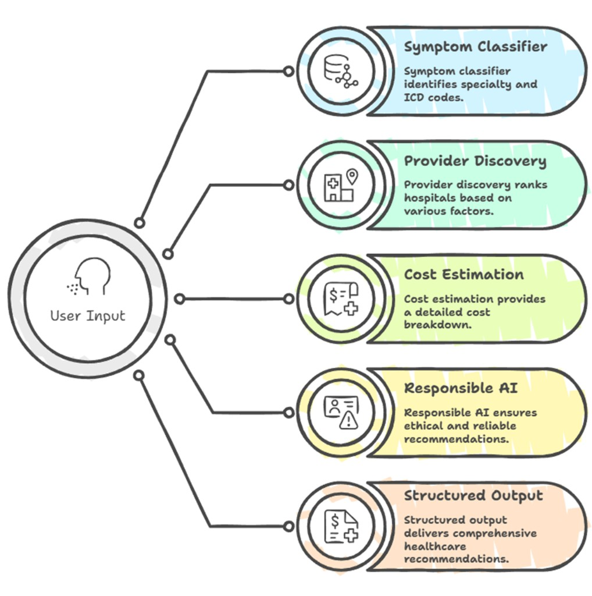
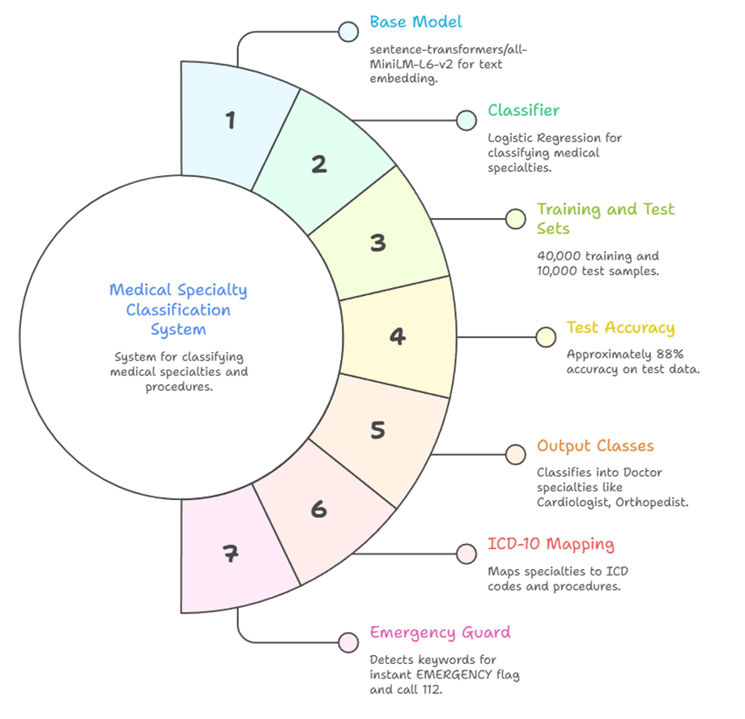
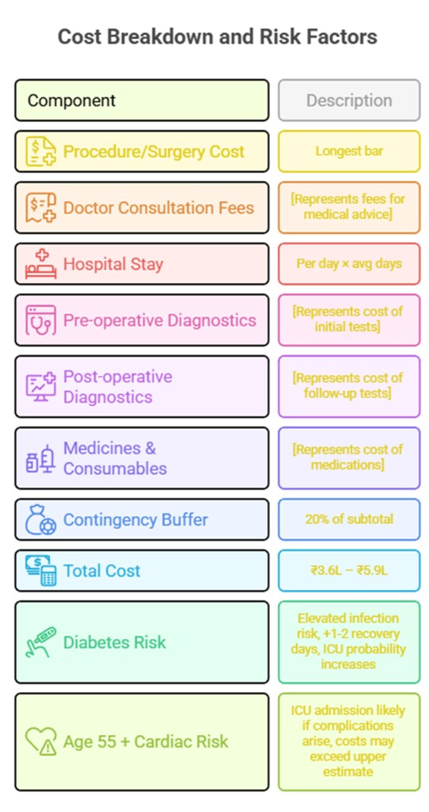
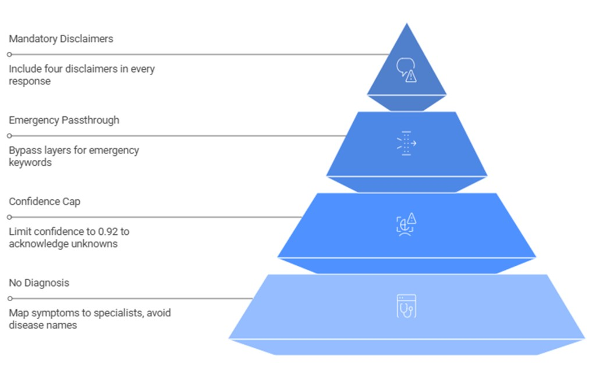

# MedRoute

<div align="center">

**AI-powered healthcare navigation and cost intelligence for India**

*Translate symptoms into a clinical pathway, find the right provider, and know the cost — before you go.*

[](https://python.org)
[](https://fastapi.tiangolo.com)
[](#tests)
[](#docker)

</div>

---

## What it does

```
Input ──────────────────────────────────────────────────────────────────
  "chest pain while climbing stairs, diabetic, 55 years old, Hyderabad"

Output ─────────────────────────────────────────────────────────────────

  Specialist ── Cardiologist        ICD: I25 (CAD)
  Procedure  ── Angioplasty         Urgency: HIGH
  Confidence ── 0.81                Label: moderate_confidence

  ┌─────┬──────────────────────┬────────┬──────────┬────────────────┐
  │ Rank│ Hospital             │ Score  │ Distance │ Cost Range     │
  ├─────┼──────────────────────┼────────┼──────────┼────────────────┤
  │  1  │ Apollo Hospitals     │  0.87  │  3.2 km  │ ₹4.8L – ₹7.2L │
  │  2  │ Yashoda Hospitals    │  0.81  │  5.1 km  │ ₹3.6L – ₹5.9L │
  │  3  │ Care Hospitals       │  0.76  │  2.8 km  │ ₹3.4L – ₹5.5L │
  └─────┴──────────────────────┴────────┴──────────┴────────────────┘

  Cost breakdown  (Angioplasty · metro · age 55 · diabetic + hypertensive)
  ┌──────────────────────────┬───────────────────────┐
  │ Procedure / surgery      │  ₹1.5L  –  ₹2.8L     │
  │ Doctor fees              │  ₹25K   –  ₹46K       │
  │ Hospital stay (3–5 days) │  ₹38K   –  ₹75K       │
  │ Diagnostics pre-op       │  ₹17K   –  ₹29K       │
  │ Diagnostics post-op      │  ₹9K    –  ₹14K       │
  │ Medicines & consumables  │  ₹23K   –  ₹40K       │
  │ Contingency (20%)        │  ₹60K   –  ₹1.1L      │
  ├──────────────────────────┼───────────────────────┤
  │ TOTAL                    │  ₹3.6L  –  ₹5.9L     │
  └──────────────────────────┴───────────────────────┘

  Lender signal ── pre_approve_eligible
  Max loan ──────── ₹5.3L   (90% LTV)   Urgency: HIGH
```

---

## System architecture

Four sequential layers. Each independently testable and replaceable.

### End-to-end system design

High-level flow from user input to final structured healthcare output:



### Layer 1 - Clinical mapping (Symptom classifier)

Maps free-text symptoms to doctor specialty and ICD-aligned context.



### Layer 2 - Provider discovery and ranking (text design)

```text
INPUT:
  specialty + city + user location (+ optional budget tier)

DATA:
  hospital_db.csv
  - 150 hospitals across 15 Indian cities
  - specialties, NABH status, rating, review count, cost tier, geocoordinates

SCORING LOGIC:
  final_score =
      0.40 * specialty_match
    + 0.25 * distance_score         where distance_score = 1 / (1 + km / 8)
    + 0.25 * reputation_score       where reputation_score = 0.7*rating_norm + 0.3*review_weight
    + 0.10 * nabh_bonus             where nabh_bonus = 0.15 if NABH accredited else 0

RULES:
  - Exact city filter first
  - If city has too few hospitals, fallback by city_tier (metro/tier2)
  - Optional budget filter: budget | mid | premium
  - Sort by final_score (descending), return top 3 providers

OUTPUT:
  ranked hospitals with score, distance_km, strengths, and per-hospital cost range
```

### Layer 3 - Cost estimation engine

Computes 7-component treatment cost ranges adjusted by city tier, age, comorbidities, and hospital tier.



### Layer 4 - Responsible AI output

Applies confidence cap, emergency safeguards, lender signal logic, and mandatory disclaimers.



---

## API reference

### `POST /navigate`

Full pipeline in one call.

**Request**

```json
{
  "symptoms": "chest pain while walking upstairs, breathless easily",
  "city": "Hyderabad",
  "age": 55,
  "comorbidities": ["diabetes", "hypertension"],
  "budget_preference": "mid"
}
```

| Field | Type | Required | Notes |
|---|---|---|---|
| `symptoms` | string | ✓ | Free text — symptoms, condition, or procedure name. Min 5 chars. |
| `city` | string | ✓ | Any of the 15 supported Indian cities |
| `age` | integer | — | 0–120. Affects cost multiplier. Default 35. |
| `comorbidities` | array | — | `diabetes` `hypertension` `cardiac_history` `ckd` `obesity` `copd` `cancer` |
| `budget_preference` | string | — | `budget` `mid` `premium` |

**Response**

```json
{
  "condition_mapped": "Cardiologist",
  "confidence_score": 0.81,
  "certainty_label": "moderate_confidence",
  "query_metadata": {
    "primary_procedure": "Angioplasty",
    "icd_codes": ["I25", "I21"],
    "all_suggested_procedures": ["Angioplasty", "Echocardiogram", "Stress Test"],
    "generated_at": "2025-04-22T10:34:12Z"
  },
  "recommended_hospitals": [
    {
      "name": "Apollo Hospitals",
      "rating": 4.6,
      "distance_km": 3.2,
      "cost_tier": "premium",
      "nabh": true,
      "score": 0.87,
      "estimated_cost_range": [480000, 720000],
      "strengths": ["NABH Accredited", "Highly rated", "Large facility"]
    }
  ],
  "cost_estimate": {
    "procedure": "Angioplasty",
    "city_tier": "metro",
    "breakdown": {
      "procedure_cost":   [150000, 280000],
      "doctor_fees":      [25000,  46000],
      "hospital_stay":    [38000,  75000],
      "diagnostics_pre":  [17000,  29000],
      "diagnostics_post": [9000,   14000],
      "medicines":        [23000,  40000],
      "contingency":      [60000,  105000]
    },
    "total_estimated_cost": [322000, 589000],
    "patient_multiplier": 1.37
  },
  "lender_signal": {
    "signal": "pre_approve_eligible",
    "message": "Cost range and clinical confidence support pre-approval up to ₹5L",
    "max_loan_indicative": 530100,
    "urgency": "high"
  },
  "risk_notes": [
    "Diabetes may increase infection risk and extend recovery by 1-2 days"
  ],
  "disclaimers": [
    "This is decision support, not medical advice. Consult a qualified physician.",
    "Cost estimates are indicative ranges based on benchmarks, not quotes.",
    "Hospital rankings do not constitute a medical endorsement.",
    "In case of emergency, call 112 immediately."
  ]
}
```

### `GET /health`

```json
{ "status": "ok", "service": "medroute-api", "version": "1.0.0" }
```

### `GET /ready`

```json
{ "ready": true, "checks": { "cost_matrix": true, "hospital_db": true, "specialty_map": true } }
```

---

## Lender signal

```
  ┌─────────────────────────────────────────────────────────────┐
  │  pre_approve_eligible                                        │
  │  confidence ≥ 0.70  AND  max_cost ≤ ₹5L                    │
  │  → Max loan = 90% of upper cost estimate                    │
  │  → Supports automated pre-approval, no manual review        │
  ├─────────────────────────────────────────────────────────────┤
  │  soft_eligible                                               │
  │  confidence ≥ 0.55  AND  max_cost ≤ ₹15L                   │
  │  → Document verification required before disbursement       │
  ├─────────────────────────────────────────────────────────────┤
  │  needs_review                                                │
  │  confidence < 0.55  OR  max_cost > ₹15L                    │
  │  → Route to manual underwriting queue                       │
  └─────────────────────────────────────────────────────────────┘
```

This is not a lending decision. It is a pre-qualification signal that reduces first-pass underwriter workload by flagging clear approvals versus cases needing attention.

---

## Cost model

```
  STEP 1  Base cost
  ──────────────────────────────────────────────────
  cost_matrix.json: 20 procedures × 3 city tiers
  metro ──── highest base
  tier-2 ─── ~65% of metro
  tier-3 ─── ~45% of metro

  STEP 2  Patient multiplier
  ──────────────────────────────────────────────────
  age under 40  →  1.00×
  age 41–60     →  1.12×
  age 61–75     →  1.25×
  age over 75   →  1.38×

  comorbidities (additive, capped at +50% total)
  diabetes        +12%
  hypertension    + 8%
  cardiac_history +22%
  ckd             +20%
  obesity         +10%
  copd            +15%
  cancer          +18%

  STEP 3  Hospital tier factor
  ──────────────────────────────────────────────────
  budget    0.75×
  mid       1.00×
  premium   1.40×

  OUTPUT  7-component itemised range [low, high]
  ──────────────────────────────────────────────────
  procedure · doctor · stay · pre-diagnostics
  post-diagnostics · medicines · contingency (20%)
  Always a range. Never a single number.
```

---

## Provider ranking

```
  For each hospital in the target city:

  specialty_match  ──  1.0  exact match
                       0.5  partial match
                       0.0  absent

  distance_score   ──  1 / (1 + km/8)
                       1.0  at  0 km
                       0.5  at  8 km  (half-life)
                       0.2  at 32 km

  reputation_score ──  normalize(rating, 3→0, 5→1)
                       × min(review_count / 2000, 1.0)

  nabh_bonus       ──  0.15 flat if NABH accredited
                       (National Accreditation Board for Hospitals)

  ─────────────────────────────────────────────────
  final_score  =  0.40 × specialty_match
               +  0.25 × distance_score
               +  0.25 × reputation_score
               +  0.10 × nabh_bonus
  ─────────────────────────────────────────────────
  Sort by score descending. Return top 3.
  Each hospital gets its own cost range estimate
  based on its individual cost_tier.
```

---

## Responsible AI

```
  NO DIAGNOSIS
  ─────────────────────────────────────────────────────────
  We map: symptoms → specialist → procedure
  We never name a disease.
  "See a Cardiologist for Angioplasty" ≠ diagnosis.
  "You have coronary artery disease" = diagnosis (we don't do this).

  BOUNDED CONFIDENCE
  ─────────────────────────────────────────────────────────
  Hard cap at 0.92.
  The system cannot return confidence > 0.92.
  Uncertainty is real and must be communicated.
  A perfect-confidence medical tool is a dangerous tool.

  EMERGENCY ROUTING
  ─────────────────────────────────────────────────────────
  7 hard keyword triggers bypass all 4 layers entirely:
  heart attack · stroke · unconscious · severe bleeding
  seizure · collapse · suicide

  Returns immediately:
  { "status": "EMERGENCY", "message": "Call 112 immediately." }
  No hospital list. No cost estimate. Emergency first.

  MANDATORY DISCLAIMERS
  ─────────────────────────────────────────────────────────
  4 strings hardcoded into every single API response.
  Cannot be removed or suppressed by any request parameter.
  The frontend is required to render all 4.

  RANGE OUTPUTS ONLY
  ─────────────────────────────────────────────────────────
  Every cost is [low, high]. ₹3.6L–₹5.9L is honest.
  ₹4.7L is not. No exceptions.
```

---

## Setup

### Local

```bash
git clone https://github.com/Utkarsh4412/MedRoute.git
cd MedRoute

pip install -r requirements.txt

# First time only — trains the symptom classifier (~4 min on CPU)
cd symtom_classifier
python train_embeddings.py --csv symptoms_doctor_50k.csv --out artifacts
cd ..

uvicorn main_api:app --reload
```

Verify:
```bash
curl http://localhost:8000/health
curl http://localhost:8000/ready

curl -X POST http://localhost:8000/navigate \
  -H "Content-Type: application/json" \
  -d '{"symptoms":"chest pain while walking upstairs, breathless","city":"Hyderabad","age":55,"comorbidities":["diabetes"]}'
```

### Docker

```bash
docker build -t medroute .
docker run -p 8000:8000 medroute
```

The Dockerfile downloads `all-MiniLM-L6-v2` at build time so there is no cold-start on first request.

### Environment

```bash
cp .env.example .env
```

```
API_HOST=0.0.0.0
API_PORT=8000
LOG_LEVEL=INFO
DATA_DIR=./data
ARTIFACTS_DIR=./symtom_classifier/artifacts
CORS_ORIGINS=*
```

---

## Tests

```bash
pytest
# 30 passed
```

```
tests/
├── test_cost_engine.py
│     city tier detection · comorbidity multipliers
│     7-component structure · mutable default safety
│     diabetes increases cost · old age increases cost
│
├── test_provider_engine.py
│     haversine known distance accuracy
│     result sorted by score · max 3 returned
│     required fields present · unknown specialty no crash
│
├── test_confidence_layer.py
│     hard cap at 0.92 · float in 0–1 range
│     lender signal thresholds · required output fields
│
└── test_api.py
      /health 200 · /ready true
      cardiac happy path · emergency detection
      invalid age 422 · short symptoms 422
      unknown comorbidity 422 · tier-2 city valid
      lender_signal present · disclaimers × 4 present
```

---

## Project structure

```
MedRoute/
│
├── main_api.py                     ← Unified FastAPI
│                                     /navigate · /health · /ready
│                                     validate_request() · logging middleware
│                                     X-Request-ID header on all responses
│
├── engines/
│   ├── data_loader.py              ← Loads all static data ONCE at startup
│   │                                 Prevents per-request file I/O
│   ├── provider_engine.py          ← Layer 2: haversine + 4-factor ranking
│   ├── cost_engine.py              ← Layer 3: cost matrix + patient multiplier
│   └── confidence_layer.py         ← Layer 4: confidence cap + lender signal
│
├── symtom_classifier/
│   ├── train_embeddings.py         ← MiniLM embeddings → LogReg → artifacts/
│   ├── eval_embeddings.py          ← Accuracy + classification report
│   ├── app.py                      ← /predict (used internally)
│   ├── artifacts/                  ← clf.pkl · label_encoder.pkl · metadata.json
│   └── symptoms_doctor_50k.csv     ← 50,000 training samples
│
├── data/
│   ├── hospital_db.csv             ← 150 hospitals · 15 cities · coords · NABH
│   ├── cost_matrix.json            ← 20 procedures × 3 tiers × 7 components
│   ├── specialty_to_procedure.json ← specialty → procedures + ICD-10 codes
│   └── comorbidity_weights.json    ← age brackets + comorbidity multipliers
│
├── tests/                          ← 30 tests, all passing
├── frontend/                       ← Web UI
├── Dockerfile
├── .env.example
├── requirements.txt
└── pytest.ini
```

---

## Data

**`hospital_db.csv`** — 150 hospitals across 15 Indian cities. Fields: name, city, city_tier, specialties (comma-separated), nabh_accredited, rating, review_count, cost_tier, lat, lon, bed_count, description.

**`cost_matrix.json`** — 20 procedures with metro / tier-2 / tier-3 variants. Each contains per-component cost ranges (procedure, doctor_fee, stay_per_day, avg_stay_days, diagnostics_pre, diagnostics_post, medicines) and a contingency percentage.

**`specialty_to_procedure.json`** — Maps each doctor specialty to 2–4 clinical procedures, ICD-10 codes, and an urgency level (low / medium / high). The urgency level feeds directly into the lender signal.

**`comorbidity_weights.json`** — Age bracket multipliers and per-comorbidity additive adjustments. Comorbidity total is capped at +50% to prevent unrealistic estimates for complex patients.

---

## Cities covered

**Metro** — Mumbai · Delhi · Bangalore · Hyderabad · Chennai · Kolkata · Pune

**Tier 2** — Nagpur · Ahmedabad · Jaipur · Lucknow · Indore · Surat · Bhopal · Coimbatore

Unlisted cities default to tier-3 pricing.